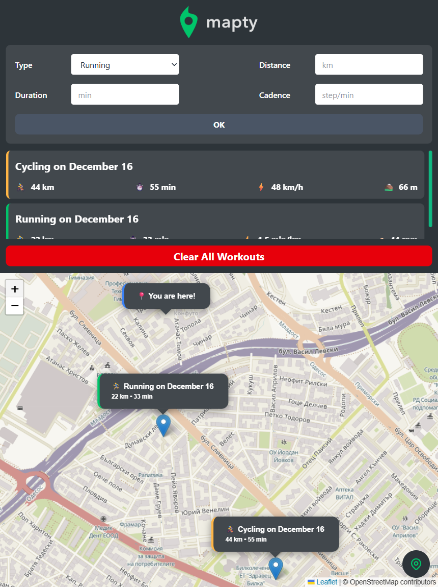
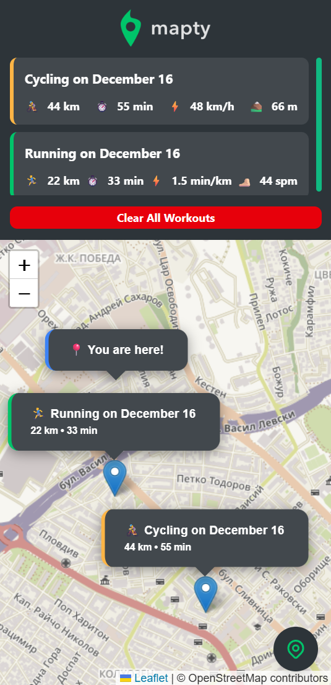
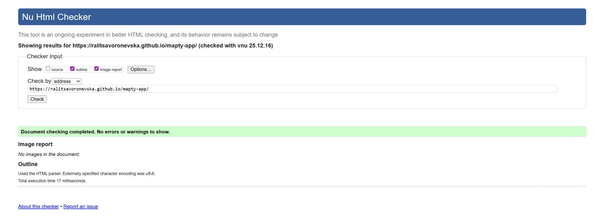
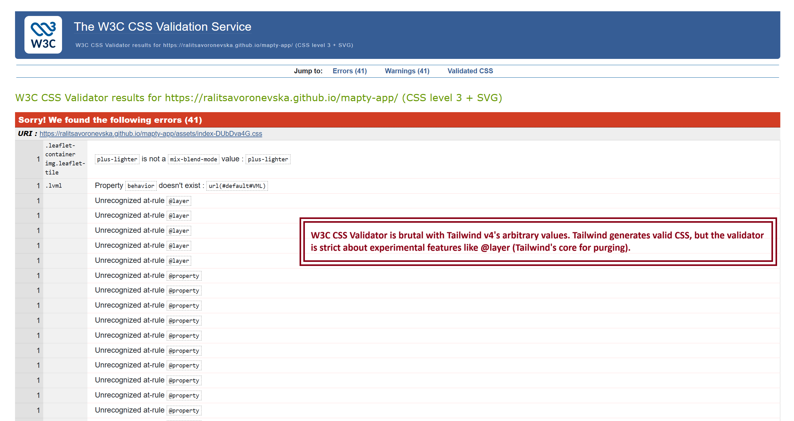
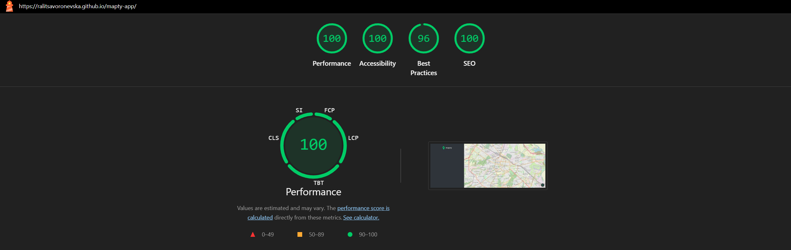

# 🗺️ Mapty App

I've built an Advanced Workout Tracker by following the [The Complete JavaScript Course 2025: From Zero to Expert!](https://www.udemy.com/course/the-complete-javascript-course/) course.                                                           

🔗 [Live GitHub Preview](https://ralitsavoronevska.github.io/mapty-app/)

<details>
<summary>📸 Screenshots</summary>

## 🖥️ Desktop preview:


<table width="100%">
  <thead>
    <tr>
      <th width="65%" style="border: none;">📱 Tablet Preview</th>
      <th width="35%" style="border: none;">📱 Mobile Preview</th>
    </tr>
  </thead>
  <tbody>
    <tr>
      <td width="65%"></td>
      <td width="35%"></td>
    </tr>
  </tbody>
</table>

<br>

# 🏅 W3C HTML Validator


<br>

# 🏅 W3C CSS Validator


<br>

# 🌈 Chrome LightHouse Audit

Desktop:



<br>

Mobile:


<br>

# ⚡ PageSpeed Insights Results

Desktop:


<br>

Mobile:


</details>  
        
<br>

# 🛠️ Built with:

                                                                                                                                                
             


🔨 Fully Responsive, Mobile First Approach, Transitions, Animations, Grid & Flex Layout                                                               
⛏️ [OpenStreetMap](https://www.openstreetmap.org/)                                                                          
🪚 [LeafletJS](https://leafletjs.com/)                                                                                                          

# ✨ Features:
✅ Getting user's geolocation with "My location" button                                                                                            
✅ Visualizing interactive Leaflet popups per workout                                                                                                     
✅ Providing persistent storage                                                                                                                           
✅ Custom scrollbars                                                                                                                              

# 🧰 Online resources and tools:
                                                                     
🖼️ [Photopea [Online Photo Editor]](https://www.photopea.com/)                                                                         
<br>

# 🌐 Browser Support:
(Last updated and tested: 17/12/2025)                                                                                                            
🌟 Chrome 143.0.7499.147 (64-bit)                                                                                                           
🦊 Firefox 146.0 (64-bit)                                                                                                                 
🏴‍☠️ Opera 125.0.5729.21 (64-bit)                                                                                                        
🪟 Edge 143.0.3650.80 (64-bit)                                                                                                                   

# 🧪 Online Validators:
✔️ [W3C HTML Validator](https://validator.w3.org/)                                                                                          
✔️ [W3C CSS Validator](https://jigsaw.w3.org/css-validator/)                                                                           
💡 [LightHouse Audit](https://developers.google.com/web/tools/lighthouse/)                                                                  
⚡ [PageSpeed Insights Audit](https://pagespeed.web.dev/)                                                                                         
⭐ [WebPageTest](https://www.webpagetest.org/)                                                                                               


## Install
`cd` to project's dir and run `npm install`

## Vite builds
Vite is next Generation Frontend Tooling featuring unbundled web-development

## Hot-reloads for development
Start the development server on http://localhost:5137:
```bash
$ npm run dev
```

## Builds and minifies for production
```bash
$ npm run build
```

## Serves recently built app
```bash
$ npm run preview
```

<br>

# 🌟 Inspiration & Credits:
▶️ [The Complete JavaScript Course 2025: From Zero to Expert!](https://www.udemy.com/course/the-complete-javascript-course/)                                  
🪄 [Grok 4](https://grok.com/)                                                                                                                                
:octocat: [GitHub Coplit](https://github.com/features/copilot)                                                                                               
                                                                                                              
---
  
🙌 Thank you for checking out my project! More is coming 🔜.                                                                                           
Stay tuned 🚀 and please don't forget to give the project a star! ⭐                                                                                     
Made with lots of 💗, ☕, and a sprinkle of ✨ by Ralitsa Voronevska!                                                                                